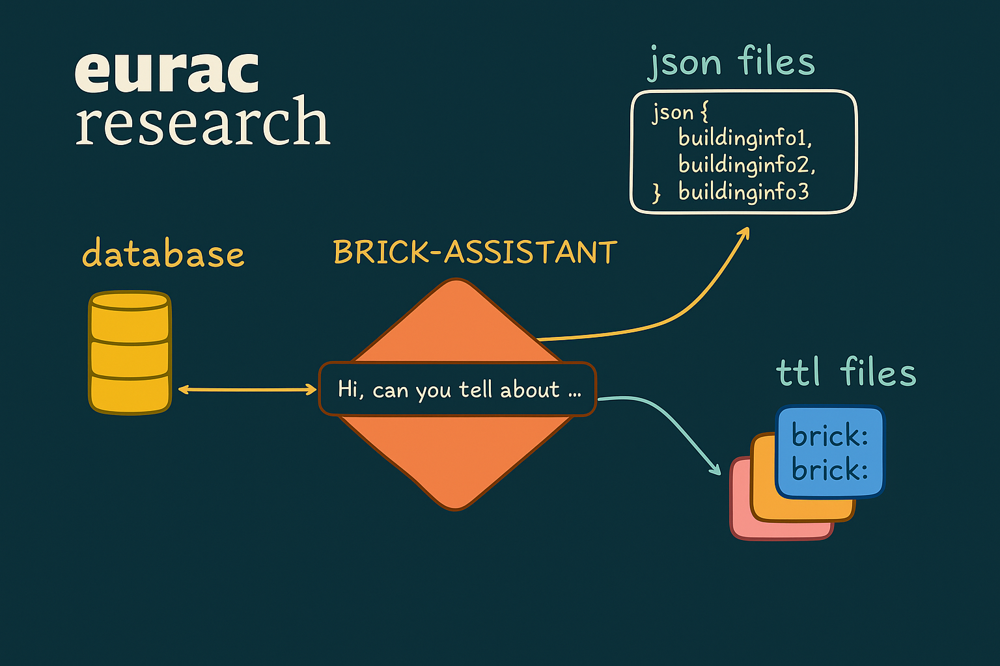
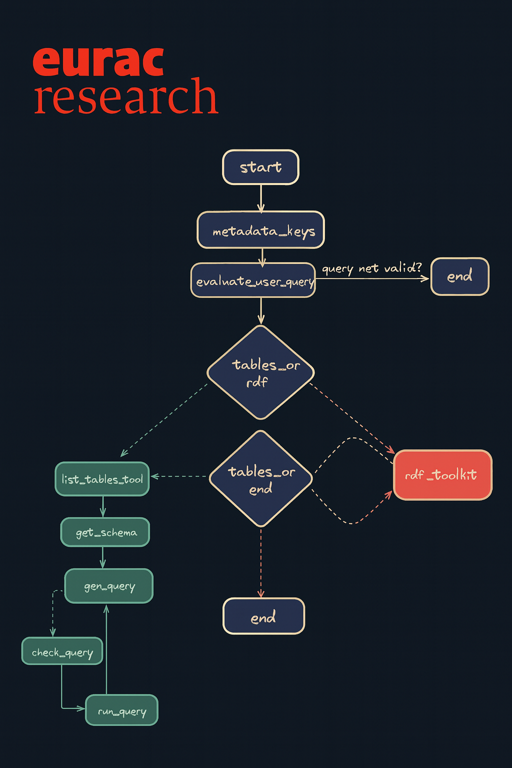

# 🧱🔗 Brick Assistant 

## Brick Assistant is an AI-powered tool designed to help you query and interact with your building datasources using natural language.



## Overview
The Brick Assistant can answer questions like:
- "What is the average temperature in the building X over the last week?"
- "How many VAVs are there in the building?"
- "What is the building with the biggest area ?"
- "List all the AHUs in the building and their associated zones."

And so on...

## Installation

The project uses UV for dependency management. To install the required dependencies, I suggest you first install uv and then run the following:

```bash
uv sync
```

Syncing ensures that all project dependencies are installed and up-to-date with the lockfile.
If the project virtual environment (.venv) does not exist, it will be created.

Given that the project also import its own package and modules, you need to install it in editable mode:

```bash
uv pip install -e .
```

## 🗂️ Project structure
The project was built to be modular and extensible. Let's dive in into the main components:

### 📁 config
- configs.py:
This module contains configuration settings for the project, including API keys and other constants.
The necessary fields are visibile in the ```.env.example file which must be copied and renamed to .env``` and filled with the appropriate values.

### 📁 tools

This module contains the actual nodes of the graph as well as the tools and edges that connect them. This latter are used to create the graph structure that the agent will use to reason about the data, but have been incorporated within the tools function by means of the new Langgraph Command module that lets us embed graph edges directly within the tool definition.
Specifically:

- functions.py:
Main function nodes in the graph. Each function represents a specific operation that can be performed on the data, such as querying a database or processing information.
The workflow of each function is as follows:
    1. Receive input from the previous node or the user.
    2. Process the input using the appropriate logic (e.g., querying a database, performing calculations).
    3. Return the output to be used by the next node in the graph or to be presented to the user.

- prompts.py:
This module contains prompt templates used to guide the AI in generating responses. 

- rdf_query.py:
This is the core module for the more complex functionality within the project, which is the SPARQL query generation. Current LLMs still struggle to generate correct SPARQL queries from natural language prompts, so a more structured approach has been taken. A set of queries ````(that can be easily expanded )```` are predefined. 
Those are then orchestrated by the LLM only to decide which one to use and with which building. The queries are executed using the rdflib library and syncing them with a safe lock mechanism to avoid concurrent access to the same graph.

- tools.py:
Earliest experiments saw the instantiation of a BrickExploration tool class that would handle all the graph exploration and querying. However, this approach was inefficient in terms of token usage and performance.
It is left here as a reference, and ````not used in the current implementation but to be added!!!```` as a backup in case that predefined queries are not enough.

### 📁 graphs
Chore module of the project. This is where the workflow is defined and all the other pieces are glued toghther. 

- abstract_rdf.py:
This is the skeleton of our graph. Its main purpose is to make the tools available for the actual graph.
Specifically it instantiates the SQL set of tools and the RDF query tool. The workflow is yet not defined here to leave the possibility to build different graphs with different workflows using the same set of tools.

- wuerth_graph_rdf.py:
This is the actual graph that is used in the project. It inherits from the abstract_rdf.py and defines the workflow using the tools defined there.

### 📁 evals
This module contains evaluation scripts to test the performance and accuracy of the Brick Assistant.
- evals.py:


