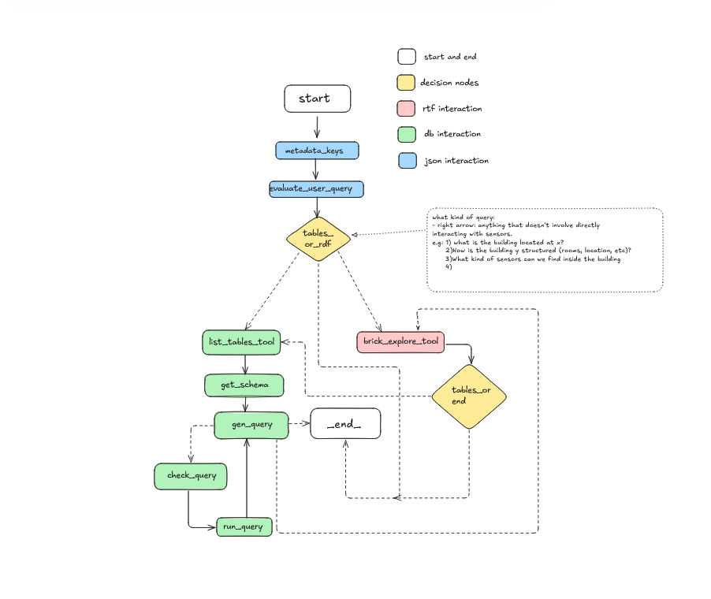

# Würth Agent

A Python package implementing an intelligent agent built with LangGraph for unified access to diverse data sources within the Würth ecosystem.

## Overview

The Würth Agent provides a conversational interface that seamlessly integrates and queries three distinct data sources:

- **PostgreSQL Database** - Structured relational data
- **RDF BRICK Ontology Files** - Semantic building information modeling data
- **JSON Metadata Files** - Descriptive metadata about the data sources

The agent intelligently routes queries to the appropriate data source and can combine information across sources to provide comprehensive responses.

## Architecture

The project follows a modular architecture with the following structure:

```
src/wuerth_agent/
├── tools/          # Data access tools for each source
├── edges/          # Conditional routing logic
├── nodes/          # Processing nodes for the graph
├── graphs/         # Graph definitions and configurations
└── config/         # Configuration settings
```

Additionally, there's a `vanilla.ipynb` notebook for interactive experimentation with the agent.

## Key Components

### Tools
- **Query Evaluator Tool**: `query_evaluator_tool` for validating user queries and be sure that they are well posed
- **Database Tools**: `list_tables_tool`, `get_schema_tool`, `run_query_tool`
- **RDF Tools**: `brick_explore_tool` for BRICK ontology exploration
- **Metadata Tools**: `metadata_tool_keys` for JSON metadata access

### Graph Flow
The agent uses a StateGraph that:
1. Determines the appropriate data source based on the query
2. Routes to PostgreSQL, RDF, or metadata tools
3. Executes queries and processes results
4. Can combine results from multiple sources
5. Maintains conversation state using MemorySaver



### Conditional Routing
Smart routing logic determines the best path through:
- `tables_or_rdf_edges_end` - Initial source selection
- `rdf_or_end` - RDF to metadata transitions
- `evaluate_query_condition` - User query validation and execution

## Installation 

It has been used uv as a package, dependencies and virtual env manager so it is advised to stick with it for easier set up.

```bash
pip install uv
```

### Install the project after cloning the repo

```bash
cd /path/to/your/project
uv sync --locked --all-extras --dev  
uv pip install -e .                 
```

## Configuration

Set your OpenAI API key in the configuration:
You should set it in the .env file in:
```bash
 src\wuerth_agent\config\.env.
```
At the moment I left my own OPENAI_API_KEY so that members of the EEB group can experiment and play freely with it.

## For DB access
At the moment I am using my own local instance of the timescale db from the repo https://gitlab.inf.unibz.it/eeb/moderate_wurth_benchmarking.git.

I suggest you contact olga.somova@eurac.edu to help you set up a docker instance of the db with all relevant data.

## TTL files
The rdf files in the turtle format are located in the data folder in the root of the project. 
The agent doesn't use an api at the moment to query the rdf data but it streams directly from the ttl files.
So it is important to check that the path to the files is correctly set in the config file in the `src/wuerth_agent/config/settings.py` file.

## LangGraph Studio
LangGraph Studio provides a visual interface to interact with the agent. You can:
- View the graph structure
- Inspect nodes and edges
- Execute queries and see results in real-time
- Debug and trace execution paths
To access LangGraph Studio, run the following command:

```bash
uv run langgraph dev
```
Be mindful that in case you want to use another graph instead that the one I set for the agent you should also set it in the langgraph.json file in the root of the project.

## Frontend Integration
As a playground for users who prefer a seamless interaction with the agent living all details aside and just play with it, I have created a simple frontend that can be used to interact with the agent.

To run the frontend, execute:

```bash
chainlit run frontend_chainlit.py 

```
This will start a web server where you can chat with the agent, view responses, and explore data sources interactively.

## Data Sources

### PostgreSQL Database
Access structured data through SQL queries. The agent can:
- List available tables
- Retrieve table schemas
- Generate and execute SQL queries
- Validate query syntax

### RDF BRICK Ontology
Explore semantic building data using BRICK ontology standards. Identify building systems, equipment, and relationships.

### JSON Metadata
Access descriptive metadata about data sources, including:
- Building IDs and sensor UUIDs
- Location of the buildings

## Features

- **Intelligent Query Routing**: Automatically determines the best data source for each query
- **Multi-source Integration**: Combines information from different sources in a single response
- **Conversation Memory**: Maintains context across multiple interactions
- **Query Validation**: Ensures SQL queries are syntactically correct before execution
- **Extensible Architecture**: Easy to add new data sources or modify existing ones

## Dependencies

- LangGraph
- OpenAI API -> but soon it will be possible to integrate other providers as well or local models 
- PostgreSQL adapter
- RDF processing libraries
- Standard Python libraries for JSON handling
- Chainlit for frontend interaction
- uv for package management and virtual environment handling
- Jupyter for notebook exploration

## Contributing

The modular architecture makes it easy to extend the agent:
1. Add new tools in the `tools/` directory
2. Create corresponding nodes in `nodes/`
3. Define routing logic in `edges/`
4. Update the graph configuration

## Validation
It is still to be implemented but the road map is to use the `langgraph` validation tools to ensure that the agent's responses are accurate and relevant.
For example, i need to validate that the agent is actually fetching data from the building that the user is asking for and not from another one.

## License

TBD